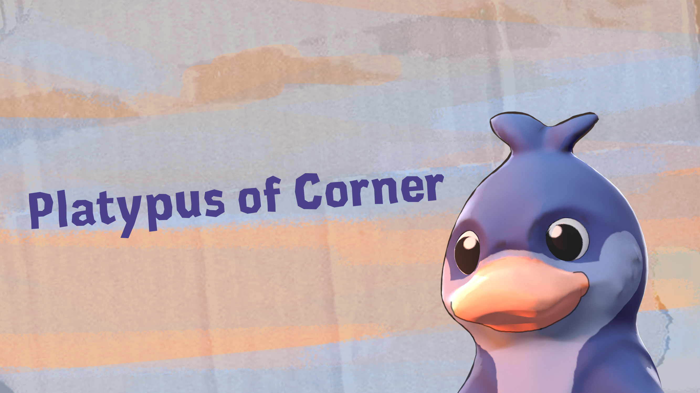

# 🦆 **Platypus of Corner**

**Un platformer 3D onirique créé sous Unity lors d'une Game Jam de 48h**



## 📜 **Description du projet**

**Platypus of Corner** est un court platformer 3D développé sous **Unity** lors d'une **Game Jam de 48 heures** par une équipe de 7 étudiants de **Ynov Lyon**.
Le thème de la jam était **« Onirique »**. Vous incarnez une créature mystérieuse piégée dans un monde flottant et surréaliste, luttant contre le temps pour récupérer les fragments d'un rêve brisé.
Vous avez **3 minutes** pour explorer, résoudre des énigmes, relever des défis de plateforme et récupérer **3 fragments de rêve** cachés à travers différents niveaux.
Le temps est limité — et s'il vient à manquer, le rêve s'efface.

## 🧩 **Fonctionnalités principales**

1. **Gameplay de plateforme en 3D**

   * Parcourez des environnements oniriques avec un déplacement **ZQSD** et un **contrôle libre de la caméra** via les flèches directionnelles.
   * Chaque niveau propose une mécanique de gameplay ou une énigme unique à maîtriser.

2. **Énigmes interactives**

   * Résolvez de petites énigmes environnementales et des tâches d'exploration.
   * Interagissez avec le monde grâce à la touche **E**.

3. **Exploration à durée limitée**

   * Le joueur dispose de **3 minutes** pour collecter les 3 fragments de rêve.
   * Si le temps vient à manquer, le rêve — et votre progression — disparaît.

4. **Projet d'équipe en Game Jam**

   * Conçu, développé et peaufiné en **moins de 48 heures**.
   * Assets 3D, level design et systèmes de gameplay originaux, réalisés de zéro.

## 🚀 **Installation et mise en route**

1. Téléchargez le fichier ZIP depuis [itch.io](https://hugoflandrin.itch.io/platypus-of-corner).
2. Décompressez l'archive.
3. Lancez `PlatypusOfCorner.exe`.
4. Explorez le monde du rêve !

## 🛠️ **Technologies utilisées**

* **Moteur** : Unity
* **Langages** : C#
* **Outils** : Unity Editor, Visual Studio, Git

## 📦 **Structure du dépôt**

```
├── UnityProject/               # Projet qui ne peut être lancé que via Unity
    ├── Assets/                     # Contenu du jeu (scripts, scènes, modèles, etc.)
    ├── Packages/                   # Références des packages Unity
    ├── ProjectSettings/            # Configuration du projet
├── GameBuild/                      # Jeu compilé (Windows .exe)
    ├── PlatypusOfCorner.exe        # Fichier à lancer pour jouer
├── img/                        # Images pour le README.md
├── README.md
└── .gitignore
```

## 🎥 **Démonstration du projet**

Vous pouvez voir une vidéo de démonstration du projet ici :
[](https://youtu.be/7KIVlAa6Wa0)

## 👥 **Équipe et crédits**

Créé lors d'une Game Jam de 48h par des étudiants de **Ynov Lyon**.

**Artistes et designers 3D**

* [Maxence Parlati](https://www.linkedin.com/in/maxence-parlati/) — Level design, Rigging, Environnement & Props, Éclairage
* [Jane Renier](https://www.linkedin.com/in/jane-renier-644240201/) — Personnage, Texturing, Animation, Key Art
* [Samuel Hebrard](https://www.linkedin.com/in/samuel-hebrard-97518a31b/) — Level design, Texturing, Éclairage
* [Robin Mallet](https://www.linkedin.com/in/robin-mallet-02ab25282/) — Environnement & Props, Texturing, VFX
* [May-lee Patte](https://www.linkedin.com/in/may-lee-patte-625bba297/) — Environnement & Props, Texturing

**Programmeurs**

* [Hugo Flandrin](https://github.com/HugoFlandrin) — Programmation gameplay, Intégration UI, Système audio, Intégration des assets
* [Alex Micoulet](https://www.linkedin.com/in/alex-micoulet/) — Programmation gameplay, Intégration UI, Game feel, Systèmes d'interaction

## 🌙 **Plongez dans le monde du rêve. Le temps est compté…**
